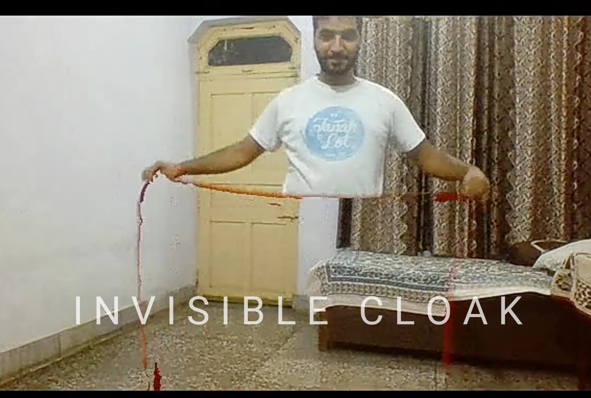

# Invisible-Cloak-through-Computer-Vision

The logic is very simple. We are extracting each frame of the video, with the help of segmentation.

-> Then we separate the background and foreground of the image. 

-> Then replace the foreground of a particular color with the background which gives the illusion of getting disappeared.

-> Here I have taken red colored cloth for getting disappeared, you can use any color of your choice.

Workflow of this project :

1. Importing needed libraries and generate the output video

2. Recording and caching the background for each frame.

3. Detecting the red portion in each frame

4. Replacing the red portion with a mask image in each frame

5. Producing the surprising output
